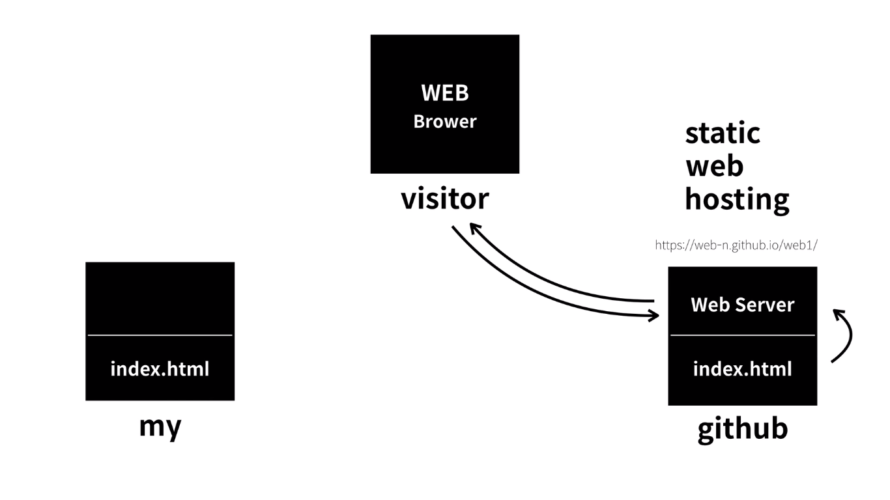

# Web-Basic

## 생활코딩 web 강의 구성

html, css, javascript를 전반적으로 배운다.

강의는 다음과 같이 구성되어있다.

<ol>
    <li>WEB1-HTML&INTERNET (수강 중)</li>
    <li>WEB2-CSS</li>
    <li>WEB2-JAVASCRIPT</li>
    <li>WEB2-HTTP</li>
    <li>WEB3-AJAX</li>
    <li>JAVA SCRIPT 입문 수업</li>
    <li>JAVA SCRIPT For Web Browser</li>
</ol>

## web hosting

github는 web hosting을 하는 사이트 중 하나이며

내(my) 코드를 전세계 사람들에게 무료로 보여 줄 수 있다.

위 그림에서는 web server에 해당된다.

## Apache Web Server 설치

<a href="https://bitnami.com/stack/wamp/installer">BITNAMI WAMP (APACHE WEB SERVER) Download</a>

위 링크에서 bitnami wamp(window apache mysql php)를 다운받을 수 있으며 phpmyadmin만 설치하면 mysql, apache http server가 다운받아진다.

## 